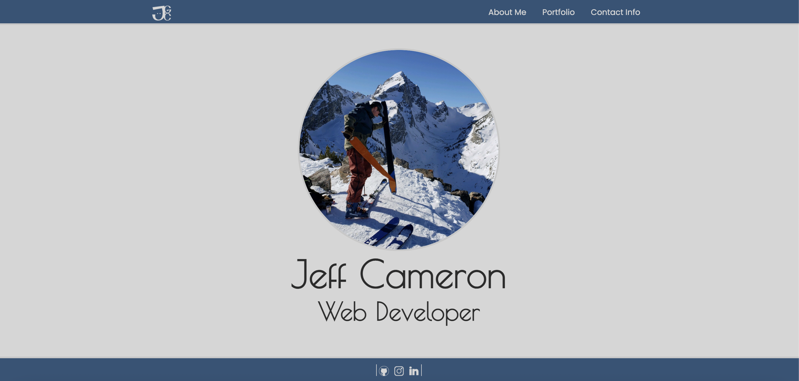

# Responsive Portfolio Site 

### Requirements

* Functional, deployed application

* GitHub repository with README describing the project

* Navbar must be consistent on each page.

* Navbar on each page must contain links to Home/About, Contact, and Portfolio pages.

* All links must work.

* Must use semantic html.

* Each page must have valid and correct HTML. (use a validation service)

* Must contain your personalized information. (bio, name, images, links to social media, etc.)

* Must properly utilize Bootstrap components and grid system.

## Individual Process

To start, I designed my profile first focusing on the layout, the design, and then the content. I created a logo as well to personalize my site and make my work more recognizable. Once I had an idea of how I wanted my site to look and function I applied my html, css, and bootstrap knowledge. Below is a screenshot of my homepage, which can be accessed through clicking the logo in my nav bar. My footers has links to my social media as well. I used mostly bootstrap grids witht he exception of a media query to display a hamburger menu when the site became to small or cluttered for the full navbar text.

## Homepage Screenshot

### Website Link

https://jeffgcameron.github.io/Portfolio/

